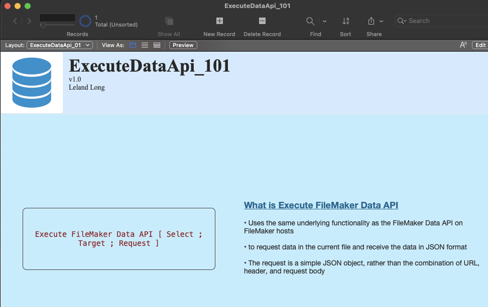

# ExecuteDataApi_101

#### A FileMaker Pro training aid

Learn more about JSON by creating JSON queries and parsing the JSON responses from using the Execute FileMaker Data API script step.

#### Prerequisites

This training aid assumes NO prior JavaScript knowledge.
You do need a basic understanding of Filemaker concepts such as Tables, Fields, Layouts, Webviewers, and Scripts.

#### Usage

1. Download and open the zipped Filemaker Pro database

2. Read the first section, then move to the next one in the Layouts drop-down menu

3. Several scripts are available for further exploration of this topic

#### Dependancies

This database uses no additional dependancies.
